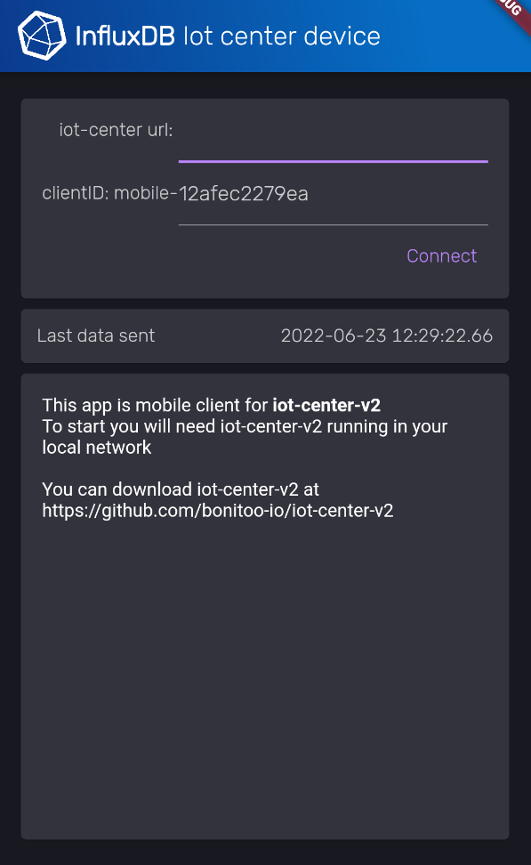

# IoT Device flutter

    
    
    

  

This repository contains the IoT device application that connects into iot-center-v2 and writes sensor data through InfluxDB dart client.

## Features

- autodiscover and connect to iot-center-v2 in local network
- write real data from different sensors
- changeable clientID of device

## Quick Start

- Prerequisites
  - Flutter 2.10 or newer
  - iot-center-v2 *(pulled Jun 17 or newer)*

### Flutter
0) Download [flutter](https://docs.flutter.dev/get-started/install)
0) Check if everything works with `flutter doctor` command.

### iot-center-v2

You can start iot-center-v2 via **docker** or **pull it as repository** *if you don't have it already running.*

#### start iot-center-v2 using Docker 
0) Download and install [docker](https://www.docker.com/get-started/).
0) Execute `docker-compose up` in project root.
0) iot-center-v2 should be running on `localhost:5000`

#### run iot-center-v2 from repository
0) Clone or download [iot-center-v2 repository](https://github.com/bonitoo-io/iot-center-v2)
0) Follow instructions inside iot-center-v2/readme.md
0) iot-center-v2 should be running on `localhost:5000`

## Develop and Play with IoT Device Flutter

Ensure you have at least one android or ios device running (virtual or connected by cable with usb debuging enabled). You can show available devices by running `flutter devices`.

Now you can run application by executing `flutter run` command.

## How to use iot device flutter.

Open mobile dashboard at `http://localhost:5000/dynamic/mobile`. swap *localhost* for ip if iot-center-v2 running on different device.

Application is aimed to be simple as possible. App will try to find running instance of iot-center-v2 on start. If this is successfull you will have your app already connected to iot-center-v2 or you can enter your iot-center-v2 url manualy othervise.

You can enable sending data into InfluxDB of any availeble listed sensor simple by tapping it or disable by tapping again. There is also last value of sensor displayed under it.

After you have at least one sensor sending data, refresh your mobile dashboard.
It should automaticaly select your newly added device or if you have already some device, select it from Choose device dropdown.

Done, you should see your data in mobile dashboard.

## Code

All iot-center-v2 relevant code is inside `iot_center_client_dart.dart` file. More iot-center-v2 clients in different language are availeble inside [iot-center-v2 repository](https://github.com/bonitoo-io/iot-center-v2)

## Building

execute `flutter build apk` or `flutter build appbundle`, app will be builded into `build/app/outputs/bundle/release/`

## License

The project is under the [MIT License](https://opensource.org/licenses/MIT).
